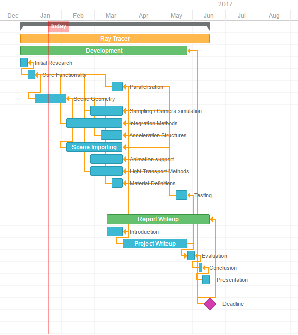
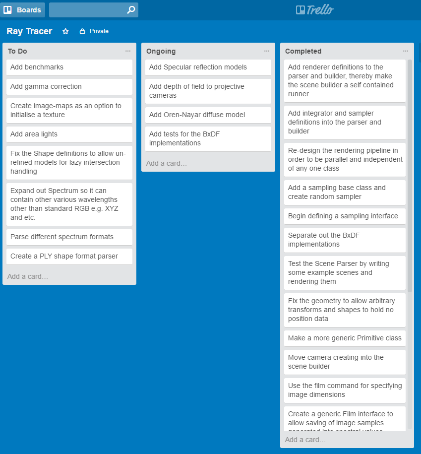

# EPQ Diary

##### 14/12/16
I have begun working on a prototype for my Ray Tracer, in order to test if the project is feasible whilst it is being approved by my supervisor, which will render basic spheres in a hard coded scene. The reason I am doing this is so that I can be more confident that I can complete the project in time since doing a practical software project means I will be more pushed for time than most report-based EPQ projects.

##### 18/12/16
So far, development on the prototype has been going well I've been able to accurately render basic spheres with reflections and corrrect calculations of the geometry and intersections. This gives me confidence that my project will be feasible and has given me a better insight into which tasks will require the most effort to complete. Specifically, I've now realised that there is a lot of material available of this topic, much of it is very advanced and only for rendering specific types of scenes so I will need to filter out important information when doing research which will also require more time than I had intially thought it would. Also, before starting I thought the transformations involving maths would take a lot more time but they all seem to be working correctly now.

##### 02/01/17
Using information gained from the prototype, I have begun to think about dividing the project into separate manageable tasks which will all contribute to the final product. In order to manage my workflow, I used the website GanttPro to generate a Gantt chart which I can use to work against the final report deadline and measure how well I am keeping up with progress. For smaller tasks, I intend to maintain a TODO-list on the website Trello which I will use to structure the tasks from the Gantt chart.

##### 06/01/17
Today I completed my project review, my supervisor approved of my project proposal and I plan on continuing the project as planned. The comments from my supervisor were mainly addressing how important it is for me to keep track of how much work I will need to be putting in and make sure that I am managing my time effectively.

##### 18/01/17
The rendering code has been going well with each part working as I would have expected so far, this week I have also put a start on writing Unit Tests which I run every now and then to ensure that new additions to the code don't break other parts which should be functioning properly. This does take extra effort and time now but, in the long run, it will help save time by helping my trace down bugs to their source much faster.

##### 25/01/17
I had a lot of difficulty today implementing the next stage of the ray tracer, using projective cameras to simulate how light passes through a camera to create rays rather than manually creating them as was done before. It took me over 2 hours to find the relevant bugs which turned out be inside the Transform class when chaining together sequential transformations (e.g. doing a rotation then a translation), I initially thought the bugs were in my Camera implementations which was why it took such a long time.

Eventually, I manually used a debugger to step through my code line by line until I realised where the error was happening. For me, this has highlighted how important it is to create more unit tests at each step, I plan on adding more so that I don't waste time finding simple bugs in the future. In the end, however, I managed to get my Camera implementations working correctly which was no small relief and they have produced some nice results.

##### 01/02/17
This week I haven't made much progress on the actual code of the ray tracer itself, the reason being there is a lot of theory on illuminance and reflectance which I will have to learn before I can implement any further additions to the code. I am planning on researching how to implement scattering distribution functions and apply them to my shape and intersection classes in order to obtain a more accurate simulation of the light itself. At the same time I am planning what code I will be writing so that it can all fit together nicely.

##### 10/02/17
Over the past few days I have been adding into my surface scattering distribution classes called BSDFs (Bi-directional scattering distribution functions) which I spent the previous week learning and reading about from Chapters 5-7 of PBRT book and also from the website "Scratch a pixel". It took a while before the I got the implementations working correctly, they were outputting some strange results before I managed to track down all the bugs causing it. I have tried to make the implementations as generic as possible, currently only basic matte materials are used but later I will add more complex definitions for materials such as metals and glass. After rendering using these new definitions the output image is largely unchanged however there are some changes in the bright parts of the image which appears to model real light better.

##### 16/02/17
Recently, I have been working on developing a generic scene builder class, currently I have been manually defining where all the objects in the scene are and their properties but this will allow me to re-use properties between objects and eventually be able to work on writing a parser which will mean I can render existing 3d scene formats allowing me to compare my output to existing renderers.

##### 25/02/17
I have completed most of the base work required for parsing the existing scene format used for the PBRT file format as described in their book, this took a lot more time than I was expecting because I had to follow their exact specifications in order to be able to correcly parse and read information about the scene from the file. I've also made some slight modifications in the rendering code, previously light passed un-changed over distance but now it varies correctly inversely with the square of the distance. I've managed to render a basic file rendering a teapot from the PBRT website and, although it renders correctly, it runs very slowly and it has highlighted my next task which is to work on optimising the performance of the renderer.

Below is my current status of my Trello chart showing which tasks I have compeleted and those which I plan on doing:

##### 06/03/17
Recently, I have been working on creating a more generic interface for the renderer and sampler. This has largely been successful and there wasn't much difficulty in terms of bugs or errors whilst I was developing this part. In addition, the main outcome from this is parallelism. Previously, only one thread would do all the computation but now, using multi-threading, the work load can be shared across multiple processors which I have already measured to have a 4-5x speedup.

##### 18/03/17
I have made a lot of progress since having completed the previous section. The main work I have been doing is creating an accelerator to speed up the time taken to intersect light rays with the scene geometry, using a grid system to avoid un-necessary calculations. This has meant I first needed to modify the existing intersection testing code so it would return some partial derivatives and other extra information needed by the accelerator. Then the actual accelerator had to be created which was in fact quite simple but the gain in performance has been huge. For example in complex scenes such as the teapot, the new program outputs the same image in less than a tenth of the time.

##### 27/03/17
Over the last two weeks I have begun to write more for my report since I have realised that the actual project development won't be completed in March so I will have to develop my original deadlines that I had set in my original Gantt chart to take into account how much work I estimate is still required to be completed. So far, I have completed the introductory section and a section on the parsing process which has given me a total word count of around 2500 words. In addition, I have also done more work on the project by smoothing out normals, this has made a noticeable change to the teapot which now looks much more realistic.
