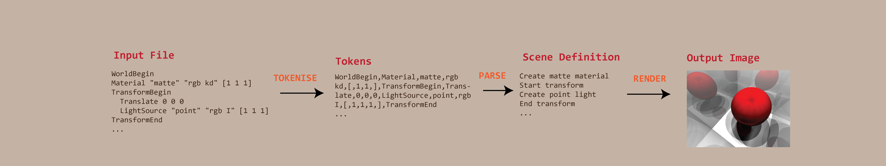
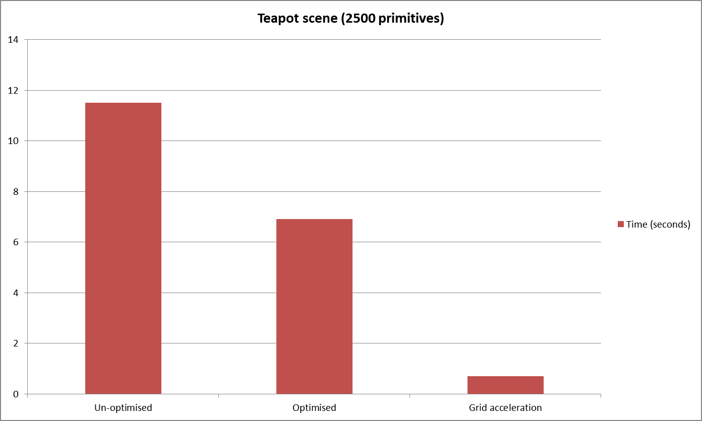
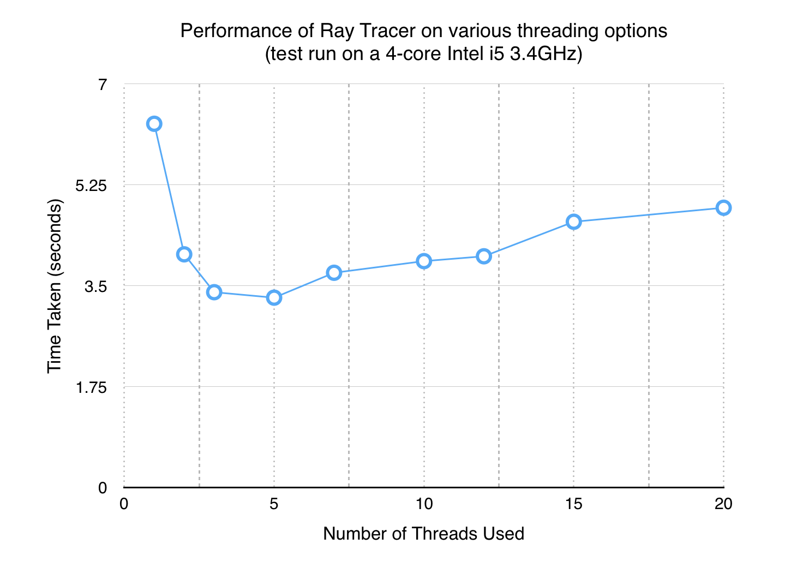
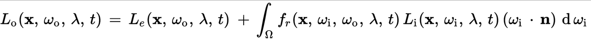

# Building a functional 3D ray tracer and to what extent it can simulate realistic light behaviour.

## Introduction

In the modern world we are constantly surrounded by realistic computer generated imagery. From incredibly realistic films with awe-inspiring graphics to real-time immersive video games which provide a temporary escape into virtual reality. Out of the top 10 grossing games of 2015, 7 are based on a virtual 3D environment[[3](#3)] and would have dedicated developers working on rendering systems. The selling point of these ventures is the depth of realism which they offer[[4](#4)]  and, in recent years, this has really been a major market pull for research into more efficient rendering techniques resulting in exciting developments in the field[[5](#5)].

Behind the scenes, these renderers have a high variety of techniques they employ in order to capture the environment as we see it. They model the interaction of light rays with a whole host of materials with increasing degrees of accuracy. In this project, I plan to investigate how these techniques are used achieve results by building my own ray tracer from scratch and evaluating how well it can render compared to existing implementations.

## Project Overview

There are two main categories that the majority of renderers fall into. The distinction is made between techniques relying on _rasterization_ vs _ray/path tracing_. The basic methodology for ray tracing is to trace a multitude of rays for each pixel of the resulting image to compute how much light arrives from that direction. This is done by simulating the physical properties of light; including reflection, refraction and the effect of different materials on incoming light e.g. metals vs. glass. However, even for small images, the light along _millions_ of rays has to be computed resulting in slow running times. The payback for all this effort is a photo-realistic output which naturally simulates realistic phenomenon such as soft shadows, global illumination and caustics [[2](#2)]. 

In contrast, rasterization provides a faster approach by dealing directly with points and transformations. Rather than simulating the passage of light, the vertices in 3D are directly mapped into 2D screen space and, for points not on vertices, the rendering attributes are calculated by interpolating (taking a weighted average based on distance) between the vertices [[2](#2)]. The advantage of this technique is that it applies the exact transformation applied to every point which can be efficiently implemented in modern computers which are armed with powerful GPU's (Graphical Processing Units) capable of applying the same transformation to thousands points in parallel. The downside of this method is that it gives very little in terms of expressing realistic light behaviour, reflections and translucency are incredibly difficult to model and light behaviour such as shadows and ambient lighting have to be manually added using heuristics which often don't produce realistic results.

As a result, rasterization is mainly used for real-time applications such as games and interactive animations where the speed of rasterization pays off, but ray tracing is the go-to method for pre-rendered material such as films, packaging and anything relying on realistic CGI  . In this project, I plan on making a ray tracer because I am interested in investigating how and to what degree physically based models can produce accurate photo-realistic images and a real-time application isn't necessary. In addition, at the moment it is difficult to apply the same kind of optimisation for ray tracing due to hardware limitations but this is a field of active research with some very promising results [[7](#7)]. Therefore, with the advent of ever more powerful technology there is a high possibility that ray tracing could be made efficient enough for real-time purposes.

### Project Goals

For my project, I cannot hope to achieve as realistic results as are available in large team based projects but I aim to achieve atleast a good enough level of realism that can illustrate the ability of current models to be able to model realistic light processes. In order to access how well my renderer can do this, I plan on comparing the output of my renderer and that of an existing implementation on similar models. In addition, I could also compare photographs of light behavior (refraction, caustics and soft shadows) and evaluate on how well the output images from my renderer simulate those effects. 

Note: Throughout the project I will be making references and comparisons to an existing rendering system from a book called 'Physically Based Rendering Techniques'[[1](#1)] for which I will use the abbreviation PBRT (which is also the name given to the official renderer created based on the book).

### Choice of Technology

In order to build the application, I had to first decide which programming language to use to build it in. The industry standard for rendering systems is using C++ since it provides a high degree of low level support which allows you to optimise efficient code, also C++ provides very little overhead meaning its memory usage is often far lower than others. However, for this project I have decided to use a different programming language called Scala. This language is more expressive and higher level meaning it would require less program code to be written than the equivalent in C++, so would require less development time. Another advantage is that it runs on the Java Virtual Machine (JVM), as a result the program, once compiled, can be run on any system supporting Java and the JVM is a highly optimised system which will provide a fast runtime (although not as fast as C++). 

A useful tool in helping my decision was an experimental ray tracer [[6](#6)] which was run as a benchmark to compare the performances of languages. It showed that Scala is roughly 3 times slower than the same algorithm written in C++, but it used less than half the number of lines of code. For a large project with many developers C++ is a good choice, but in my case Scala's conciseness outweighs the relatively small performance loss. In addition, Scala is easier to maintain and debug therefore even more time would be saved in development when reasoning about the algorithms.

## Project Development

### Overview of the Ray Tracing algorithm

The overall rendering algorithm I will use throughout the rest of my project, as mentioned earlier, will be the ray tracing algorithm. Within my code, I have gone deeper into breaking down each stage of the rendering process into separate into sections which can then be developed separately and linked together to form the final product. A major benefit of separating the sections is that it will make the code much simpler to maintain and test for bugs. For example, if I notice that the image is actually upside down then I could quickly trace that there is an error in the implementation of my file saving code. However, each time I separate out the code it will create more latency and waste time communicating between each section of the program so a balance needs to be made to decide how many sections I will create.

My final decision for sections was mainly influenced by reading the code of the implementations of the code of the PBRT render[[9](#9)] and from the Minilight[[6](#6)] renderer. Below is a simplified illustration of how the sections link together and a brief explanation of their roles.

<strong>
  Parser -> Sampler -> Camera -> Integrator
</strong>

First, when the program is run an input file is required which contains a file describing the image to be rendered. It is the role of the parser to read in this file and from it create a sequence of rendering commands. For example, it could specify to render a sphere at location (0, 0, 0) with a radius of 5 and a material of red plastic and to point the camera so that the sphere is in the centre of the screen. The file will also specify what to output, e.g. the dimensions of the image and where to save the file once it has been rendered.

Next, it is the role of the sampler to pick which points on the screen to fire rays through. The most basic implementation would select a single light ray through the centre of each pixel in the image. However, this doesn't always produce the best results for more complex images where multiple rays will need to be fired for each pixel and in different locations. Once a location has been chosen, it is the role of the camera to actually generate the ray by taking into account parameters such as depth of field which help to simulate realistic camera output.

Last but not least, the integrator is where the main work of this project lies in. This section is responsible for taking a light ray (as generated by the camera) and working out how much light enters the camera through that light ray. It has to take into account all the objects and lights in the scene and how different materials interact with the light. The inner mechanism of the integrator will be described in depth in a later section.

### Parsing Existing Scene Formats

In order to be able to properly compare the output of my ray tracer with existing realistic implementations I would need to be able to render the exact same images which I could then use to evaluate the effectiveness of my ray tracer. For this purpose, I chose to write a scene parser that would read in a text file in the format specified by PBRT [[8](#8)] and then use that to load the scene which would then be rendered using the ray tracer. The main difficulty in this was that I needed to follow the exact specification of the scene format in order to be able to read everything without coming across errors. In other parts of the project I was free to make modifications that would simplify the code and make it more efficient to do in Scala (since most existing implementations are in C++), however for the parsing I would have to implement all the details but I would still be free as to _how_ I would parse the details.

The parsing process itself is composed of a series of well-defined steps each which process the input file further in order to be used for the next stage. This process is very general and is commonly used in most parsing systems however, since the PBRT file format is quite simple the parsing that I will need to do will be relatively simple compared more complex parsing systems that are designed to operate on much more intricate language definitions. The diagram below illustrates the simplified pipeline that I have used in my own parsing system from the input file to the final image output.

  

The first stage involves reading the stream of characters from the input file given to the program, then a process called _tokenising_ is performed. This heavily simplifies the input by removing comments, whitespace and sectionining groups of characters into entities known as _tokens_. Luckily for me, tokenising is a very common procedure and there was a builtin class in the Scala libraries called StreamTokeniser which handled most of heavy duty work and all I had to implement was a thin wrapper over it so it would function according to my needs. Now, the input file has been transformed from a stream of characters into a stream of tokens.

Consequently, the second stage reads in these tokens and builds a sequence of rendering commands out of them. This was one of the more complex tasks since it was specific to the PBRT file format and I needed to match the specification exactly doing this process. Each rendering command would require multiple tokens and I built a whole set of parsing functions in order to be handle each type. In order to do this, I consulted the specification[[8](#8)] as mentioned but also the existing source code[[9](#9)] which allowed me to double check to make sure that the logic I used was correct in my own code and also as a guideline to structure my own code. For example, when reading the input file it could end up referencing another file to read input out of, as a result the second stage would have to call the first stage again to ask for more tokens from a different file. This process could have been quite complex to implement but, using the existing implementation, I saw the original creators had the idea to use a data structure called a stack which helped me to simplify my code. 

Eventually, each rendering command would then be passed onto the rendering pipeline, the details of which have been the topic of discussion of the rest of the report. From there the final image would then be generated using all the various rendering techniques and options set by the image file. In the end, I am quite happy with the results of my parser and I managed to read the vast majority of the file format (some parts were omitted for simplicity) using just under 1200 lines of code - compared to the C++ Parser used within the actual PBRT implementation which uses about 4500 lines of code[[1](#1)]. This further highlights how using Scala has been a good tool to increase productivity and reduce how much code will be needed.

### Camera Simulation

An integral part of the ray tracing process is to be able to actually generate the rays that will eventually be traced against the scene for incoming light sources. In my ray tracer, the generation of these light rays is abstracted by the 'Camera' interface.  For each ray, two main things are required: the start position and it's direction. 

The first type of camera is called an Orthographic camera, this camera generates rays by starting at the location on the screen and setting the direction to be going directly out of the image, perpendicular to the screen. As a result, using an orthographic camera will result in an image which looks 'flat', i.e. parallel lines in the scene remain paralell lines in the image. Although this can be a desirable property for testing, a realistic camera implementation does not have this quality and instead maps objects depending on how far away they are from the camera. In an orthographic camera, the object would look the same size no matter how far away it was hence it doesn't often result in an authentic image output.

A better camera simulation is by using a perspective camera, this camera takes into account the distance of an object so that objects which are further away appear proportionally smaller. As a result, an extra parameter is required when creating a perspective camera: the FOV (field of view). This is a single number which specifies the range of vision of the camera ranging from 0° to 180°, to simulate typical human vision the FOV is generally set to around 60° to 70°[[6](#6)]. In addition, with a perspective camera it can also be used to simulate depth of field and the effect of different lens sizes on the image, this results in the image being focused at a certain distance whilst blurring out the rest which is a better simulating of how real life cameras operate.

Both these camera implementations can be implemented simply as a projection by applying the same transformation for each incoming sample location. The orthographic camera will apply an orthographic projection (as described above) and the perspective camera will apply a perspective projection. This projection must be efficient as it will be applied hundres of thousands of time for each image rendered, hence I decided to use a matrix multiplication to combine all the steps into one computation. The matrix I have used for each projection is a commonly used matrix, for which one of the first descriptions was by Carlbrom and Paciorek[[6](#6)]. In my raytracer, I used their definition for orthographic and perspective projections in order to generate rays. Below is a comparsion of both camera implementations:

- TODO: Create an image showing a comparison of both orthographic and perspective cameras

### Optimisation Strategies

Ray tracing is a very expensive process, in terms of both time requirements and memory needed to render an image. As a result, a lot of research in recent years has been towards finding techniques to reduce both of these requirements[[7](#7)]. For my raytracer, the goal has been mainly to go for photorealism and speed has not been the goal of the project. However, even for my requirements optimisations are definitely required otherwise rendering good quality scenes would take many days, whilst with sufficient optimisation strategies (described in depth below) this time can be reduce to less than an hour to produce the exact same image.

The first stage of optimisation was to go through the code and see where I can use a different code construct that would result in less memory wasted and faster runtime. By applying this general process throughout the code, I was able to see a roughly 30% improvement in speed when comparing the runtime on the same scene wit the optimised and the un-optimised code. For Scala, this meant having to look through code and see where I could cache expensive computations so that results could be saved for future use and additionally remove un-necessary variables which increased memory usage.

Those optimisations are generally seen as 'low-level' where the gain in performance is a constant factor of the original speed, e.g. always running twice or three times as fast. However, another kind of optimisation is to reduce the _complexity_ of the program. In this way, the program doesn't slow down as much for larger scenes hence allowing me to scale well into larger and more interesting scenes. In raytracing, the program spends most of the time testing rays for intersection since it has to iterate over all the objects in the scene to work out which one intersects with the ray first. In raytracing, there are techniques known as _acceleration data structures_ [[2](#2)] which aim to help reduce this time.

There are many existing implementations of acceleration data structures, I have decided to for the grid-based method [[11](#11)] based on the original source by John Amanatides in his 1987 paper "_A Fast Voxel Traversal Algorithm for Ray Tracing_". There have been many newer acceleration data structures such as bounding-volume hierarchies and KD-tree's both of which have been shown to have better worst case performance than the grid based method[[1](#1)]. However, the grid method has a much simpler implementation thus saving me time in creating it, furthermore it has a good enough performance that it should not make much of a difference. After implmenting the grid acceleration data structure I measured some very notable performance increases compared to without using any acceleration data structures or even with the language-level optimisations that I described in the paragraph above. My results are shown in the graph below.

  

Over the past decade, computers have stagnated in terms of the clock rate that they can achieve as CPU manufacturers have reached physical limits since the heat generated by high output cores would be too much for normal operation. Instead, to meet demands for increasing computational power, manufacturers have provided multi-core CPU's which can run multiple computer programs in parallel, each task running in parallel is known as a thread. This effectively allows separate programs to be run at the same time giving a very significant performance gain. However, the chief caveat of this is that programs have to be specifically designed to be run in parallel and take advantage of running parts simultaneously which isn't possible for all programs. Luckily, ray tracing is known as an _embarrassingly parallel problem_ [[2](#2)] which means that very little work is required to allow the program to be able to run in parallel. The reason for this is because each light ray is traced independently and they have no interaction with each other whatsoever, i.e. the resulting colour for one pixel does not directly effect the colour for the next pixel. For this reason, we can trace multiple light rays in parallel and still achieve the exact same image.

From my research into the potential performance gains parallel programming, I also decided to implement parallelisation to be able to render images faster. Based on an approach I learnt from examining PBRT renderer source code[[9](#9)], I determined that the best approach would be to split the image into separate segments each of which would be run in parallel as a separate thread in the program. This approach is quite straightforward, but I also needed to figure out a suitable number of tasks to split the program into for optimal performance. From reading the book PBRT, I found that choosing a the number of tasks by taking the number of cores in the machine and multiplying by a constant factor which would be determined on the specific machine type[[1](#1)]. In order to test this I ran tests to see which task count gives the best performance; my results are summarised in the graph below.

  

The results above were for the teapot scene, and in this case the best performance was achieved when having 4 threads, which was equal to the number of cores that I had on the machine which the test was run on. I repeated the test for multiple scenes and I found similar results varying from 4-10 threads having the best performance and for larger scenes it was closer to the upper end of the spectrum, i.e. 4 threads performed better in small scenes such as the teapot in the graph above and 10 threads performed better in larger scenes that I rendered.

# Material Definitions

In order to be able to render a scene accurately I needed a way to describe the materials and properties that could be applied to various objects within the scene. As a hard example, I had to define code that would differentiate between how light reflects off metals against how it interacts with glass. This posed a challenge since different materials absorb different frequencies of light at different angles and have various degrees of reflection and refraction, all unique to every material. Surprisingly, in order to fully capture all of these properties only a single function is required: the _bi-directional scattering distribution function_[[13](#13)](BSDF). This function takes a pair of spherical coordinates (angles in 3D) and returns the fraction of light that the material permits to travel between that pair of directions. Despite being very simple to define, this function is all that is needed to encapsulate how a material will interact with light at any angle from any direction[[13](#13)]. From researching into existing ray tracers, this seemed to be the standard method used across all models, as a result, I decided to create all my material definitions based on their BSDFs.

In order to define the functionality of BSDFs in my ray tracer, I created a 'Material' interface which would take in a position on a surface and evaluate the BSDF for that material at that location. In practice, the position argument was quite complex to define since it needed to capture all the intricacies of the surface since objects which have the same material type (e.g. 'glass') will have different properties depending on whether the surface is flat or curved. As usual, an approximation is needed to capture this detail and the one I decided to use is known as a first order approximation, if you are familiar with calculus this is by taking into account only the first derivative term in the taylor series expansion for a function about a point. In order to store this, I created a class called 'DifferentialGeometry' which held all the first order data namely: the position, surface normal, tangents and partial derivatives of the surface.

Subsequently, each material then makes use of the data in the DifferentialGeometry provided to evaluate the BSDF. The implementation of how this is done is completely different for each material. Within each material, to compute the BSDFs I used freely available online data where scientists had experimentally determined the reflective properties of some common materials and shared the formulae that they had shown to model the BSDF for that material. In addition, whilst using the data directly from the source I also looked at the source code for the PBRT ray tracer[[9](#9)] from which I gained ideas on how to implement the equations faster for computing. As a concrete example, I will give a brief overview of how the code functions for the glass material which was based on the description given in the PBRT book[[1](#1)]. First, the angle is calculated between the surface normal and incoming light vector, this angle is then used to compute the fresnel di-electric equation[[1](#1)] which computes the percentage of light is reflected vs transmitted. This is needed since if you look at glass head on then it appears clearest as all of the light is refracted through however, at a shallow angle most of the light is reflected. After this calculation, Snell's law is applied to calculate the direction of the refracted ray and additionally the reflected ray is also calculated separately.

I repeated a similar process of implementing standard equations for various materials including copper, plastic, matte and glossy surfaces. In addition, I made the material section modular so I could easily go back and add more materials later on.

# Surface Integration

After each ray has been generated, it is the role of the surface integrator to compute the amount of light arriving at a particular pixel coordinate based on information described in the scene. The end goal of any surface integrator is to solve the _rendering equation_, this is a famous equation in computer graphics first conceived in a paper by David Immel et al. and James Kajiya in 1986[[12](#12)]. The full rendering equation captures how images are formed by light and _any_ rendering system, from ones in computer games to my own ray tracer, attempt to solve this rendering equation to various degrees of accuracy. 

In order to fully understand the inner mechanics of the equation a working knowledge of multi-variable calculus and optics is required, however the basic function of the equation is quite simple to understand. My ray tracer attempts to solve this function accurately but, even then, some assumptions are required to simplify the computational workload. For instance, it assumes that everything is static and nothing in the scene is changing with time and also that the reflective properties of a surface don't vary with wavelength of light. This has a drawback since it prevents the simulation of dispersion effects such as those seen in rainbows or when shining light through a prism, but I decided not include it since it makes the program run significantly faster without changing the image much for most rendering purposes.

The equation is as in the image below:

  

Inside the equation, the left hand side defines a function for outgoing light from a particular point, which is the value which we want to compute. This is evaluated by first computing *Le* which is the amount of light emitted by that surface, e.g. the surface of the sun and a light bulb would have a non-zero emission value but something like a wall would have zero emission. The second part is the most computationally intense part and is where surface integrators get their name from, it is a spherical integral which essentially takes the sum of all the incoming light from all directions that arrive at that point. The incoming light is scaled by a _bi-directional reflectance distribution function_(BRDF) which describes the reflective properties of that particular surface as explained in the previous section. In my ray tracer, I have implemented two integrators which both have their own advantages and disadvantages as explained below.

The first model I created was the Whitted model for light transport based on the 1980 paper by Turner Whitted[[14](#14)]. This model is based upon the approximation that the vast majority of directions contribute very little to the total light so it only considers directions which need to be considered are the ones towards light sources. Thus, when evaluating the surface integral we fire recursive rays towards every light source (sometimes multiple rays per light source for a better average) and take the summed and scaled value for the final light at that point. The main advantage of this approach is that it is relatively fast, rendering most scenes in a matter of seconds whilst also produces a smooth image without much super-sampling needed. However, this model fails to simulate certain scenarios well, for instance in transparent objects where the path from the light might not be a straight one resulting in shadows for transparent objects when they should not exist[[14](#14)].

A more modern model, one which is used ubiquitously in the modern graphics industry, is the path tracing model which I also added to my ray tracer implementation. Path tracing attempts to solve a more accurate integral than the one modelled with the Whitted integrator, it evaluates randomly selected directions rather than only considering a fixed set of directions such as in the Whitted model. The naive implementation would require hundreds of ray's to be fired per sample to actually get a good image however they are techniques which I have employed that reduce this variation. In concrete terms, the techniques which I implemented were russian roulette, light sampling and importance sampling which all required modification of separate parts of the code however their core principles were all the same. Rather than sampling directions uniformly, we use the idea of probability distributions similar to the reasoning behind the Whitted model. In the Whitted model, only directions towards light sources were used but in this case we sample directions which have a higher probability of being near light source directions but could be in any direction since they are sampled randomly. This results in a faster convergence rate for the final light value so fewer samples are needed[[1](#1)] but it still requires more time than the Whitted model.

# Testing & Results

- Describe how unit tests were used for the mathematical models
- Describe the testing plan in terms of visual appearance and comparison with the PBRT renderer

- Show example images about what the ray tracer has achieved

# Evaluation

- Talk about how the project went well overall, referencing the images and how testing has proven success
- Relate back to the question for realism and then evaluate whether they are really that realistic

## References

##### 1 
###### Pharr, M., Humphreys, G. and Jakob, W. (2010) Physically based rendering: From theory to implementation - 2nd edition. 2nd edn. Amsterdam: Elsevier/Morgan Kaufmann Publishers.

##### 2 
###### Scratchapixel (no date) Available at: https://www.scratchapixel.com/ (Accessed: 8 January 2017).

##### 3
###### Romanyuk, S. (2016) Mobile Moba - a risky lane. Available at: http://www.wetapgame.com/2016/04/25/mobile-moba-risky-lane/ (Accessed: 8 January 2017).

##### 4
###### Low, G.S. (2001) ‘Understanding Realism in Computer Games through Phenomenology’, .

##### 5
###### Price, A. (2015) 24 Photorealistic blender renders. Available at: http://www.blenderguru.com/articles/24-photorealistic-blender-renders/ (Accessed: 8 January 2017).

##### 6
###### Ainsworth, H. (2013) < H X A 7 2 4 1 >: Minilight. Available at: http://www.hxa.name/minilight/ (Accessed: 10 January 2017).

##### 7
###### Altman, R. (2016) Raytracing today and in the future - Randi Altman’s postPerspective. Available at: http://postperspective.com/ray-tracing-today-and-in-the-future/ (Accessed: 25 January 2017).

##### 8
###### Pharr, M. (2014). pbrt-v2 Input File Format. [online] Pbrt.org. Available at: http://www.pbrt.org/fileformat.html [Accessed 22 Mar. 2017].

##### 9
###### Pharr, M. (2017). mmp/pbrt-v2. [online] GitHub. Available at: https://github.com/mmp/pbrt-v2 [Accessed 22 Mar. 2017].

##### 10
###### Carlbom, I. and Paciorek, J. (1978). Planar Geometric Projections and Viewing Transformations. ACM Computing Surveys, 10(4), pp.465-502.

##### 11
###### Amanatides, J. (1983). A Fast Voxel Traversal Algorithm for Ray Tracing. University of Toronto.

##### 12
###### Immel, D., Cohen, M. and Greenberg, D. (1986). A radiosity method for non-diffuse environments. ACM SIGGRAPH Computer Graphics, 20(4), pp.133-142.

##### 13
###### Bartell, F, E Dereniak, and W Wolfe. "The Theory And Measurement Of Bidirectional Reflectance Distribution Function (Brdf) And Bidirectional Transmittance Distribution Function (BTDF)". Radiation Scattering in Optical Systems (1981): n. pag. Web. 27 May 2017.

##### 14
###### Turner Whitted. 1980. An improved illumination model for shaded display. Commun. ACM 23, 6 (June 1980), 343-349. DOI=http://dx.doi.org/10.1145/358876.358882

