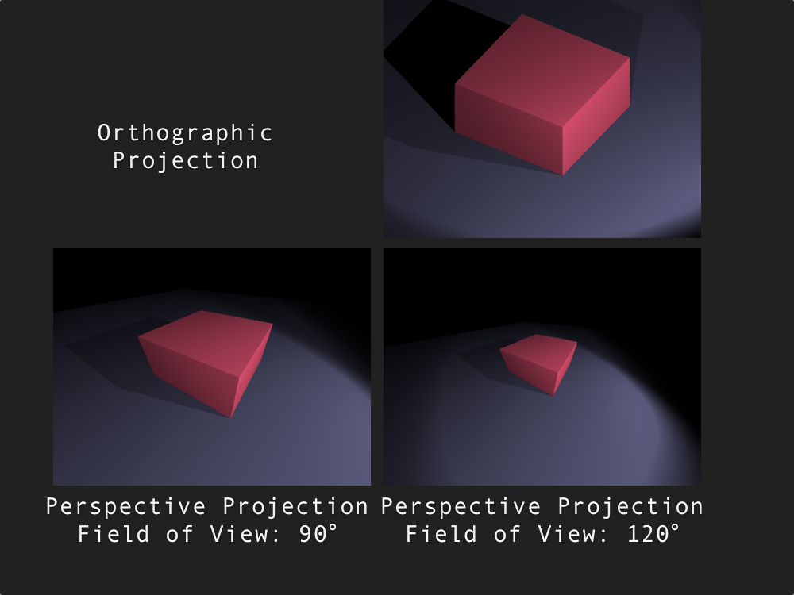
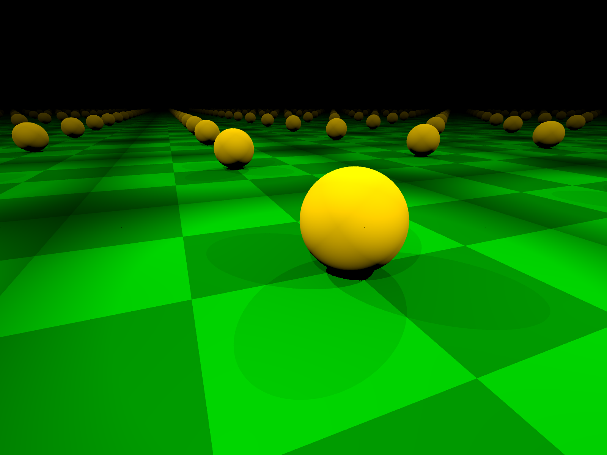

# Building a functional 3D ray tracer and to what extent it can simulate realistic light behaviour.

## Introduction

In the modern world, we are constantly surrounded by realistic computer generated imagery. From incredibly realistic films with awe-inspiring graphics to real-time immersive video games which provide a temporary escape into virtual reality. Out of the top 10 grossing games of 2015, 7 are based on a virtual 3D environment[[3](#3)] and would have dedicated developers working on rendering systems. Often, the principle selling point of these ventures is the depth of realism which they offer[[4](#4)]  and, in recent years, this has really been a major market pull for research into more efficient rendering techniques resulting in exciting developments in the field[[5](#5)].

Behind the scenes, these renderers manipulate a vast array of models and algorithms in order to capture the environment as we see it. They model the interaction of light rays with a whole host of materials in a physically accurate manner. In this project, I intend to investigate how these techniques are utilised to produce valid results by developing my own raytracer from scratch and evaluating how well it can render compared to existing implementations.

## Project Overview

There are two main categories that the majority of renderers fall into. The distinction is made between techniques relying on _rasterization_ vs _ray/path tracing_[[2](#2)]. The basic methodology for ray tracing is to trace a multitude of rays for each pixel of the resulting image to compute how much light arrives from that direction. This is done by simulating the physical properties of light; including reflection, refraction and the effect of different materials on incident light e.g. metals vs. glass. However, even for small images, the light along _millions_ of rays has to be computed resulting in slow running times. The payback for all this effort is a photo-realistic output which naturally simulates realistic phenomenon such as soft shadows, global illumination and caustics [[2](#2)]. 

In contrast, rasterization provides a faster approach: by dealing directly with points and transformations. Rather than simulating the passage of light, the vertices in 3D are directly mapped into 2D screen space and, for points not on vertices, the rendering attributes are calculated by interpolating (taking a weighted average based on distance) between the vertices [[2](#2)]. The advantage of this technique is that the exact same transformation is applied to every point and this can be efficiently implemented in modern computers armed with powerful GPUs (Graphical Processing Units) capable of applying the same transformation to thousands of points in parallel. The downside of this method is that it produces very little in terms of expressing realistic light behaviour, reflections and translucency are incredibly difficult to model and light behaviour such as shadows and ambient lighting have to be manually added using heuristics which often don't produce realistic results.

As a result, rasterization is mainly used for real-time applications such as games and interactive animations where the speed of rasterization is critical, but raytracing is the industry standard method for pre-rendered material such as films, animations and any application of realistic CGI (Computer Generated Imagery). In this project, I plan to make a raytracer because I am interested in investigating how and to what degree physically based models can produce photo-realistic images and a real-time application isn't necessary. Furthermore, as of 2017, it is difficult to apply the same kind of optimisation for raytracing due to hardware limitations but this is a field of active research with some very promising results [[7](#7)] that aim to make ray tracing feasible on GPU. Therefore, with the advent of ever more powerful technology, it is inevitable that, in the near future, raytracing will be made efficient enough for real-time purposes.

### Project Goals

For my project, I cannot hope to achieve the realism demonstrated in present large raytracers but I aim to achieve a high enough level of realism that can illustrate the ability of current models at capturing realistic light processes. In order to assess the ability of my renderer, I plan on comparing the output of my renderer and that of an existing implementation of similar models. 

Note: Throughout the project there will be references and comparisons to an existing rendering system from a book called 'Physically Based Rendering Techniques'[[1](#1)] for which I will use the abbreviation PBRT (which is also the name given to the official renderer created based on the book) whose source code is available freely online[[9](#9)].

### Choice of Technology

In order to build the application, a decision had to made as to which programming language to use. The conventional language for rendering systems is using C++ since it provides a high degree of low-level support which allows you to optimise efficient code, and it has very little overhead thus it's memory usage is often far lower than others. However, for this project, a different programming language called Scala was used. This language is more expressive and higher level, as a result it would require less program code to be written than the equivalent in C++, so would require less development time. Another advantage is that it runs on the Java Virtual Machine (JVM), as a result the program, once compiled, can be run on any system supporting Java and the JVM is a highly optimised system which will provide a fast runtime (although not quite as fast as C++). 

A useful tool in making the decision was a simplistic ray tracer[[6](#6)] available online which was run as a benchmark to compare the performances of languages. It showed that Scala is approximately 3 times slower than when the same program is written in C++, but it used less than half the number of lines of code. For a large project with many developers C++ is a good choice, but for this project, Scala's conciseness outweighs the relative performance loss. In addition, Scala would make it easier to maintain and debug therefore even more time would be saved in development when reasoning about the algorithms or making improvements to existing code.

## Project Development

### Overview of the Ray Tracing Algorithm

The overall rendering algorithm that the project will be structured upon, as mentioned earlier, will be the raytracing algorithm. Within the code, this algorithm has been structured in more depth by breaking down each stage of the rendering process into separate sections which can then be developed separately and linked together to form the final product. A major benefit of separating the sections is that it will make the code much simpler to maintain and test for faults. For example, if the image is rendered inverted then it would be trivial to trace that there is an error in the implementation of the image generation code and pinpointing the exact code would be easier. However, each time the code is segmented more latency is created and time wasted communicating between each section of the program so a balance needs to be made to decide how many sections to create.

The final decision for which sections to use was mainly influenced by reading the implementations of the PBRT renderer[[9](#9)] and the Minilight[[6](#6)]. Below is a simplified illustration of how the sections link together and a brief explanation of their roles.

<strong>
  Parser -> Sampler -> Camera -> Integrator -> Filtering & Image Output
</strong>

First, when the program is executed, an input file is required which contains a file describing the image to be rendered. It is the role of the parser to process this file and, from it, build a sequence of rendering commands. The rendering commands blueprint what shapes, materials and lights are present in the environment. They also allow the user to specify which implementation to use, such as which type of sampler or camera and also how to output the image, e.g. the dimensions of the image and where to save the image file once it has been rendered. 

Once parsing is complete, it is the role of the sampler to pick which points on the screen to fire rays through. The most basic implementation would select a single light ray through the centre of each pixel in the image. However, this approach rarely produces satisfactory results, chiefly when handling complex scenes[[1](#1)]. For these cases, multiple rays will need to be fired for each pixel and in different locations within the pixel, the resulting luminance of the pixel is calculated by taking an average of all the rays fired. 

Next, the camera generates the light rays whilst taking into account the depth of field, the field of view and the location of the pixel for the ray to start from. These parameters are applied to simulate a realistic camera and produce output such as focusing at a particular distance and the blurring of out-of-focus objects. The camera outputs the start location of the ray (on the camera film) and the direction from which the ray is going, the two implementations of cameras used in this project are listed in the section below.

Subsequently, the integrator is where the majority work of this project lies in. This section is responsible for receiving a light ray ( generated by the camera) and evaluating the intensity and colour of light entering the camera through that light ray. It has to take into account all the objects and lights in the scene and how different materials interact with the light. The integrator additionally required a method for storing and describing material properties which will be detailed alongside the inner mechanisms of the integration process.

Ultimately, once all the illumination calculations for all the pixels are complete it is the function of the display section to output this image. Prior to outputting the image, there is a post-processing stage known as filtering which seeks to remove inconsistencies from the image and make the final image have a crisper and smoother look to it. Within this section, two common algorithms were implemented, namely the triangle filter and the Windowed-Sinc filter based on the information given in the PBRT book[[1](#1)]. Once the filter is applied, the image is then displayed on the screen or saved to file depending on the user's settings for that particular rendering.

### Parsing Existing Scene Formats

In order to be able to properly compare the output of the ray tracer with existing implementations, it would need to be able to render the exact same images from a given scene description. For this purpose, the decision was made to write a scene parser that would read in a text file in the format specified by PBRT[[8](#8)] and then use that to load the scene which would then be rendered using the ray tracer. The foremost difficulty in this was that the exact specification of the scene format needed to be implemented in order to be able to read everything without coming across errors. Despite this, the implementation was completely re-written independent of how it was written in the PBRT ray tracer to make the best use of the Scala programming language.

For the code, the design began with a generic parsing algorithm then it was modified to meet the structure of the PBRT file format. The diagram below illustrates the simplified pipeline that I have used in my own parsing system from the input file to the final image output.

  

The first stage involves reading the stream of characters from the input file given to the program, then a process called _tokenising_ is performed. This heavily simplifies the input by removing comments, whitespace and sectioning groups of characters into entities known as _tokens_. Luckily, tokenising is a very common procedure and there was a built-in class in the Scala libraries called StreamTokeniser which handled most of the heavy-duty work and all that was needed was to implement was a thin wrapper around it so it would function according to what was required. Now, the input file has been transformed from a stream of characters into a stream of tokens.

Next, the second stage reads in these tokens and builds a sequence of rendering commands out of them. This was one of the more complex tasks since it was specific to the PBRT file format. Each rendering command would require multiple tokens and a whole set of parsing functions were built in order to handle each type. The logic behind these parsing functions was derived from the format specification[[8](#8)] as mentioned earlier but also the existing source code[[9](#9)]. This had the added benefit of allowing validating the logic and also as a guideline to structure the code. For example, when reading the input file it could end up referencing another file to read input out of, as a result the second stage would have to call the first stage again to request more tokens from a different file. This process could have been quite complex to implement but, using the existing implementation, the original developers had the idea to use a data structure known as a stack which was then also incorporated to solve this problem. 

Eventually, each rendering command would then be passed onto the rendering pipeline, the details have been specified in the overview section earlier. From there the final image would then be generated using all the various rendering techniques and options set by the image file.

### Camera Simulation

An integral part of the ray tracing process is to be able to actually generate the rays that will eventually be traced against the scene for incoming light sources. In the ray tracer, the generation of these light rays is abstracted by the 'Camera' interface.  For each ray, two main things are required: the start position and its direction. 

The first type of camera is called an Orthographic camera, this camera generates rays by starting at the location on the screen and sets the direction to be going directly out of the image, perpendicular to the screen. As a result, using an orthographic camera will result in an image which looks 'flat', i.e. parallel lines in the scene remain parallel lines in the image. Although this can be a desirable property for testing, a realistic camera implementation does not have this quality and instead maps objects depending on how far away they are from the camera[[1](#1)]. In an orthographic camera, the object would look the same size no matter how far away it was hence it doesn't often result in an authentic image output.

A better camera simulation is by using a perspective camera, this camera takes into account the distance of an object so that objects, when further away, appear proportionally smaller[[1](#1)]. As a result, an extra parameter is required when creating a perspective camera: the FOV (field of view). This is a single number which specifies the range of vision of the camera ranging from 0° to 180°, to simulate typical human vision the FOV is generally set to around 60° to 70°[[6](#6)]. In addition, a perspective camera can also be used to simulate depth of field and the effect of different lens sizes on the image, this results in the image being focused at a certain distance whilst blurring out the rest which is a better representation of how real life cameras operate[[6](#6)].

Both these camera implementations can be implemented simply as a projection by applying the same transformation for each incoming sample location. The orthographic camera will apply an orthographic projection (as described above) and the perspective camera will apply a perspective projection. This projection must be efficient as it will be applied hundreds of thousands of time for each image rendered, hence matrix multiplication was chosen to efficiently combine all the steps into one computation. The matrices used for each projection were based on the work done by Carlbrom and Paciorek[[6](#6)]. Their definition for orthographic and perspective projections was used to create the matrices to generate ray location and directions. Below is a comparison of both camera implementations:

  

# Material Definitions

In order to be able to render a scene precisely, there needed a procedure to describe the materials and properties that could be applied to all objects within the scene. As a hard example, a portion of code would have to differentiate between how light reflects off metals against how it interacts with glass. Initially, this posed a challenge since different materials absorb different frequencies of light at different angles and have various degrees of reflection and refraction, all unique to every material. Surprisingly, in order to fully capture all of these properties only a single function is required: the _bi-directional scattering distribution function_[[13](#13)](BSDF). This function takes a pair of spherical coordinates (angles in 3D) and returns the fraction of light that the material permits to travel between that pair of directions. Despite being very simple to define, this function is all that is needed to encapsulate how a material will interact with light at any angle from any direction[[13](#13)]. From studying existing ray tracers, this seemed to be the conventional method used across all models, as a result, I decided to create all my material definitions based on their BSDFs.

In order to define the functionality of BSDFs in my ray tracer, a 'Material' interface was created which would take a surface position as input and evaluate the BSDF for that material at that location. In practice, the position argument was quite complex to define since it needed to capture all the intricacies of the surface since objects which have the same material type (e.g. 'glass') will have different properties depending on whether the surface is flat or curved. As customary, an approximation is needed to capture this detail and the one which was chosen is known as a first order approximation, if you are familiar with calculus this is by taking into account only the first derivative term in the Taylor series expansion of a function.  In order to store this, I created a class called 'DifferentialGeometry' which held all the first order data namely: the position, surface normal, tangents and partial derivatives of the surface. These were calculated by standard formulae obtained from the PBRT book[[1](#1)].

Subsequently, each material then makes use of the data in the DifferentialGeometry provided to evaluate the BSDF. Within each material, to compute the BSDFs freely available online data was used obtained through scientists who had experimentally determined the reflective properties of some common materials and shared the formulae that had been shown to model the BSDF for that material. As a concrete example, the code for the glass material was based on the description given in the PBRT book[[1](#1)]. First, the angle of incidence is calculated between the surface normal and incoming light vector, this angle is then used to compute the Fresnel di-electric equation[[1](#1)] which computes the percentage of light reflected vs transmitted. A physical illustration of this effect can be demonstrated if you look at glass head-on then it appears clear as all of the light is refracted through, however, looking at a shallow angle most of the light is reflected. After this calculation, Snell's law is applied to calculate the direction of the refracted ray and additionally the reflected ray is also determined separately.

A similar process of implementing standard equations was repeated for various materials including copper, plastic, matte and glossy surfaces whose implementations. Most data was obtained from scientific formulae directly from the source, but a good proportion was implemented by consulting the source code for the PBRT ray tracer[[9](#9)]. 

# Surface Integration

After each ray has been generated, it is the role of the surface integrator to compute the amount of light arriving at a particular pixel coordinate based on information described in the scene. The end goal of any surface integrator is to solve the _rendering equation_, this is a famous equation in computer graphics first conceived in a paper by David Immel et al. and James Kajiya in 1986[[12](#12)]. The full rendering equation captures how images are formed by light and _any_ rendering system, ranging from ones in computer games to my own raytracer, will attempt to solve this rendering equation to various degrees of accuracy. 

In order to fully understand the inner mechanics of the equation, a working knowledge of multi-variable calculus and optics is required, however, the basic function of the equation is quite simple to comprehend. The aim is to solve this function accurately but, even then, some assumptions are required to simplify the computational workload. For instance, the raytracer assumes that everything is stationary and also that the reflective properties of a surface don't vary with the wavelength of light. This has a drawback since it prevents the simulation of dispersion effects such as those seen in rainbows[[2](#2)] or when shining light through a prism, but it was decided not include it since it makes the program run significantly faster without changing the image much for most rendering purposes.

The equation is as in the image below:

  

Within the equation, the left-hand side defines a function for outgoing light from a distinct point, which is the value which we want to compute. This is evaluated by first computing *Le* which is the amount of light emitted by that surface, e.g. the surface of the sun and a light bulb would have a non-zero emission value but something like a wall would have zero emission. The second part is the most computationally intense part and is where surface integrators get their name from, it is a spherical integral which essentially takes the sum of all the incoming light from all directions that arrive at that point. The incoming light is scaled by a _bi-directional reflectance distribution function_(BRDF) which describes the reflective properties of that particular surface as explained in the previous section. To complete this integration process, two integrators types were implemented which both have their own advantages and disadvantages as explained below.

The first model used was the Whitted model for light transport based on the 1980 paper by Turner Whitted[[14](#14)]. This model is based on the approximation that the vast majority of directions contribute very little to the total light, so it only considers directions facing towards light sources. Thus, when evaluating the surface integral we fire recursive rays towards every light source (sometimes multiple rays per light source for a better average) and take the summed and scaled value for the final light at that point, but no rays are fired away from light sources[[14](#14)]. The main advantage of this approach is that it is relatively fast, rendering most scenes in a matter of seconds whilst also produces a smooth image without much super-sampling needed. However, this model fails to simulate certain scenarios well, for instance in transparent objects where the path from the light might not be a straight one resulting in shadows for transparent objects when they should not exist[[14](#14)].

A more modern model, one which is used ubiquitously in the modern graphics industry, is the path tracing model. Path tracing attempts to solve a more accurate integral than the one modelled with the Whitted integrator, it evaluates randomly selected directions rather than only considering a fixed set of directions such as in the Whitted model. The naive implementation would require hundreds of rays to be fired per sample to achieve a good image[[6](#6)] however there exist techniques which are employed that reduce noise. Rather than sampling directions uniformly, we use the idea of probability distributions similar to the reasoning behind the Whitted model[[6](#6)]. In the Whitted model, only directions towards light sources were considered but, in this case, we sample directions which have a higher probability of being near light source directions but could potentially be in any direction since they are sampled randomly, this process is known as emitter sampling[[1](#1)]. This results in a faster convergence rate for the final light value so fewer samples are needed[[1](#1)] but it still requires more time than the Whitted model.

Overall, for my final rendering uses I used a mixture of the Whitted model and the path tracing model. For most scenes, the Whitted model did a good enough job at producing good output and the time advantage meant that I could render much higher resolution images in an acceptable amount of time (e.g. around 30 minutes). However, for certain scenes the compromises of the Whitted model resulted in non-realistic images so I had to resort to the path tracing which took considerably longer but simulated certain effects which weren't handled with the Whitted model.

### Optimisation Strategies

Ray tracing is a very expensive process, in terms of both time requirements and memory needed to render an image. As a result, a lot of research in recent years has been towards finding techniques to reduce both of these requirements[[7](#7)]. For this raytracer, the target has been mainly to go for photorealism and speed has not been the goal of the project. However, even for these requirements optimisations were unquestionably required otherwise rendering good quality scenes would take many days, whilst with sufficient optimisation strategies (described in depth below) this time can be reduce to less than an hour to produce the exact same image.

The first stage of optimisation was to go through the code and see where a more efficient programming technique could be applied that would result in less memory wasted and faster runtime. By applying this general process throughout the code, I was able to see a roughly 30% improvement in speed when comparing the runtime on the same scene wit the optimised and the un-optimised code. For Scala, this meant having to look through code and see where I could cache expensive computations so that results could be saved for future use and additionally remove un-necessary variables which increased memory usage.

Those optimisations are generally seen as 'low-level' where the gain in performance is a constant factor of the original speed, e.g. always running twice or three times as fast. However, another kind of optimisation is to reduce the _complexity_ of the program. In this way, the program doesn't slow down as much for larger scenes hence allowing the program to scale well into larger and more interesting scenes[[1](#1)]. In raytracing, the program spends most of the time testing rays for intersection since it has to iterate over all the objects in the scene to work out which one intersects with the ray first. In raytracing, there are techniques known as _acceleration data structures_ [[2](#2)] which aim to help reduce this time.

There are many existing implementations of acceleration data structures, I have decided to for the grid-based method based on the original source by John Amanatides in his 1987 paper "_A Fast Voxel Traversal Algorithm for Ray Tracing_"[[11](#11)]. There have been many newer acceleration data structures such as bounding-volume hierarchies and KD-tree's both of which have been shown to have better worst-case performance than the grid-based method[[1](#1)]. However, the grid method has a significantly simpler implementation which would save time in programming it, furthermore, it has a good enough performance that it should still be sufficient[[2](#2)]. After implementing the grid acceleration data structure some very notable performance increases were measured compared to without using any acceleration data structures or even with the language-level optimisations described in the paragraph above. The results after implementing these optimisations are shown in the graph below. 

  

Over the past decade, computers have stagnated in terms of the clock rate that they can achieve as CPU manufacturers have reached physical limits since the heat generated by high output cores would be too much for normal operation. Instead, to meet demands for increasing computational power, manufacturers have provided multi-core CPU's which can run multiple computer programs in parallel, each task running in parallel is known as a thread. This effectively allows separate programs to be run at the same time giving a very significant performance gain. However, the chief caveat of this is that programs have to be specifically designed to be run in parallel and take advantage of running parts simultaneously which isn't possible for all programs. Fortunately, ray tracing is known as an _embarrassingly parallel problem_[[2](#2)] which means that very little work is required to allow the program to be able to run in parallel. The reason for this is because each light ray is traced independently and they have no interaction with each other whatsoever, i.e. the resulting colour for one pixel does not directly affect the colour for the next pixel. For this reason, we can trace multiple light rays in parallel and still achieve the exact same image.

From research into the potential performance gains parallel programming[[1](#1)], the decision was made to implement parallelisation to be able to render images faster. Based on the PBRT renderer source code[[9](#9)], the approach towards parallelization was to split the image into separate segments each of which would be run in parallel as a separate thread in the program. This approach is quite straightforward, but a suitable number of tasks needed to be decided to divide the computation for optimal performance. In order to calculate this, tests were executed to determine which task count achieves the best performance; the results are summarised in the graph below.

  

The results above were for the teapot scene, in which the best performance was achieved when having 4 threads, which was equal to the number of cores of the machine which the test was run on. The test was repeated for multiple scenes and similar results were obtained, varying from 4-10 threads having the best performance and for larger scenes it was closer to the upper end of the spectrum, i.e. 4 threads performed better in small scenes such as the teapot in the graph above and 10 threads performed better in larger scenes that were rendered.

# Testing

As in all areas of software development, testing was a crucial and incremental part of building my ray tracer. It was critical that there was a clear test plan during all stages of development and also for the final model at the end. Within the testing, it was separated into two distinguished parts: the automated tests and the manual testing.

In software development, automated tests are known as _unit tests_. This involves writing separate program code that performs checks on other parts of the code to ensure that it is producing correct output, the advantage of this approach is that it can be easily adapted to each change made to the code to ensure that new changes don't break anything that was previously working correctly and, if they do, it identifies exactly where the issues are being generated. Test-driven development is a software development principle which involves writing unit tests for each section whilst it is being implemented, this principle was applied to smooth out the workflow as much as possible when doing the programming of the ray tracer. This approach was mainly only followed in the mathematical and physics-based sections since they were easy to perform checks on, e.g. for transformation classes unit tests ensured that a translation of (3, 0) followed by a translation of (-3, 0) would result in the original point. The only disadvantage of this type of testing was that it could not be applied to all cases, especially when there was a human-based or subjective output that did not have a definite right or wrong answer, this was where the manual testing portion came into play.

The manual testing side was mainly validation that the image output seemed coherent enough as to what a physical environment would represent and from this a lot of bugs were traced down upon inspection by noticing that the colours were not accurate or the reflections were not in the correct angle. Periodically, especially when adding a new feature, after visual inspection, a similar scene would be rendered using the PBRT ray tracer with the purpose of comparing output images and see if they produced similar output. This was especially useful when testing out refraction in the glass material, this was because by looking at the image there was no intuitive method to identify which direction the light should refract towards. It was only upon comparison that it was evident that the ray tracer was refracting light in the wrong direction.

# Results

# Evaluation

To conclude, this project has resulted in the design, development and testing of a ray tracer that produces three dimensional structured images given a scene description. Although it pales in comparison with modern, highly optimised rendering systems it has satisfied the majority of the initial objectives and has both strengths and shortcomings in meeting those targets.

Firstly, one issue that is relevant for a functioning ray tracer is it's performance. The usage of the programming language Scala was definitely a bonus for development ease, but it cannot be glossed over that it has introduced a substantial amount of overhead, both in terms of memory performance and time taken for rendering. This overhead comes due to the fact the program runs on a additional layer, the Java Virtual Machine, which prevents low level optimisations or any kind of deterministic memory profiling that a similar program written in C++ would use to it's advantage. This also comes in part from my adoption of an immutable data driven approach in which new objects are created instead of modifying existing values for ease of debugging. In order to test the impact of these factors, the performance of the ray tracer was compared against the PBRT ray tracer and the results are summarised in the graph below. As is evident, there is a significant difference in performance that only continues to increase with scaled environment sizes. Despite this, the program was still fast enough that it could render moderately complex scenes to render in a fair amount of time. In light of this, it is evident that the performance isn't by any means ideal however it is good enough to meet the requirement of a functional ray tracer.

  

One aspect which was quite successful was the parser, it managed to read the vast majority of the file format (some parts were omitted for simplicity) using just under 1200 lines of code - compared to the C++ Parser used within the actual PBRT implementation which uses about 4500 lines of code[[1](#1)]. This further highlights how using Scala has been a good tool to increase productivity and reduce the amount of code required.

In terms of realism, the images shown above all exhibit small visual artifacts that our brains can identify and consequently deduce that the image isn't an actual photograph. However, the level of realism required to convince a human that an image is of the real world is beyond the actual aims of this project. The principle reason for this being that authentic renderings require input from artists who design imperfections and position objects and lighting in a convincing, physical manner. The ray tracer does, however, simulate accurate physical properties of light and if an artist was to make use of this ray tracer then they would find it capable enough to create realistic images.

This is demonstrated in the image above which contains the infinite reflections that show that the light is travelling in straight lines, reflects correctly of the mirrors and that the images approach a horizon line. In addition, the simulator also correctly calculates the colour of light at various points depending on the angle of incident light and the reflective properties of the illuminated material. This can be visually confirmed by looking at images above and, as mentioned in the testing section earlier, was proven through systematic checking via evaluation against the PBRT ray tracer. 

That being said, there are limitations to the accuracy of simulation achieved by the ray tracer. As mentioned earlier, certain simplifications have meant that the raytracer doesn't simulate dispersion effects such as those seen in rainbows and prisms where the light at different frequencies exhibits different optical properties. Additionally, my raytracer does not handle the production of _caustics_, these are bright patches of light seen when light out at a concentrated point. This effect gives glass it's shine and diamonds their sparkle but it is also difficult to model due to the number of reflections involved. There is a technique known as photon mapping[[1](#1)] which does handle this and, if I had the time, I would extend my raytracer to support this and thus be able to model real light properties more accurately.

To conclude, I believe that this project has been a success since my main objective of building a ray tracer has been met, and it has been shown to be both functional and a physically accurate model of light to a high enough standard. In addition, through the development of the ray tracer I gained an appreciation for the strengths and weaknesses of various models in the simulation of light and it's properties.

## References

##### 1 
###### Pharr, M., Humphreys, G. and Jakob, W. (2010) Physically based rendering: From theory to implementation - 2nd edition. 2nd edn. Amsterdam: Elsevier/Morgan Kaufmann Publishers.

##### 2 
###### Scratchapixel (no date) Available at: https://www.scratchapixel.com/ (Accessed: 8 January 2017).

##### 3
###### Romanyuk, S. (2016) Mobile Moba - a risky lane. Available at: http://www.wetapgame.com/2016/04/25/mobile-moba-risky-lane/ (Accessed: 8 January 2017).

##### 4
###### Low, G.S. (2001) ‘Understanding Realism in Computer Games through Phenomenology’, .

##### 5
###### Price, A. (2015) 24 Photorealistic blender renders. Available at: http://www.blenderguru.com/articles/24-photorealistic-blender-renders/ (Accessed: 8 January 2017).

##### 6
###### Ainsworth, H. (2013) < H X A 7 2 4 1 >: Minilight. Available at: http://www.hxa.name/minilight/ (Accessed: 10 January 2017).

##### 7
###### Altman, R. (2016) Raytracing today and in the future - Randi Altman’s postPerspective. Available at: http://postperspective.com/ray-tracing-today-and-in-the-future/ (Accessed: 25 January 2017).

##### 8
###### Pharr, M. (2014). pbrt-v2 Input File Format. [online] Pbrt.org. Available at: http://www.pbrt.org/fileformat.html [Accessed 22 Mar. 2017].

##### 9
###### Pharr, M. (2017). mmp/pbrt-v2. [online] GitHub. Available at: https://github.com/mmp/pbrt-v2 [Accessed 22 Mar. 2017].

##### 10
###### Carlbom, I. and Paciorek, J. (1978). Planar Geometric Projections and Viewing Transformations. ACM Computing Surveys, 10(4), pp.465-502.

##### 11
###### Amanatides, J. (1983). A Fast Voxel Traversal Algorithm for Ray Tracing. University of Toronto.

##### 12
###### Immel, D., Cohen, M. and Greenberg, D. (1986). A radiosity method for non-diffuse environments. ACM SIGGRAPH Computer Graphics, 20(4), pp.133-142.

##### 13
###### Bartell, F, E Dereniak, and W Wolfe. "The Theory And Measurement Of Bidirectional Reflectance Distribution Function (Brdf) And Bidirectional Transmittance Distribution Function (BTDF)". Radiation Scattering in Optical Systems (1981): n. pag. Web. 27 May 2017.

##### 14
###### Turner Whitted. 1980. An improved illumination model for shaded display. Commun. ACM 23, 6 (June 1980), 343-349. DOI=http://dx.doi.org/10.1145/358876.358882
